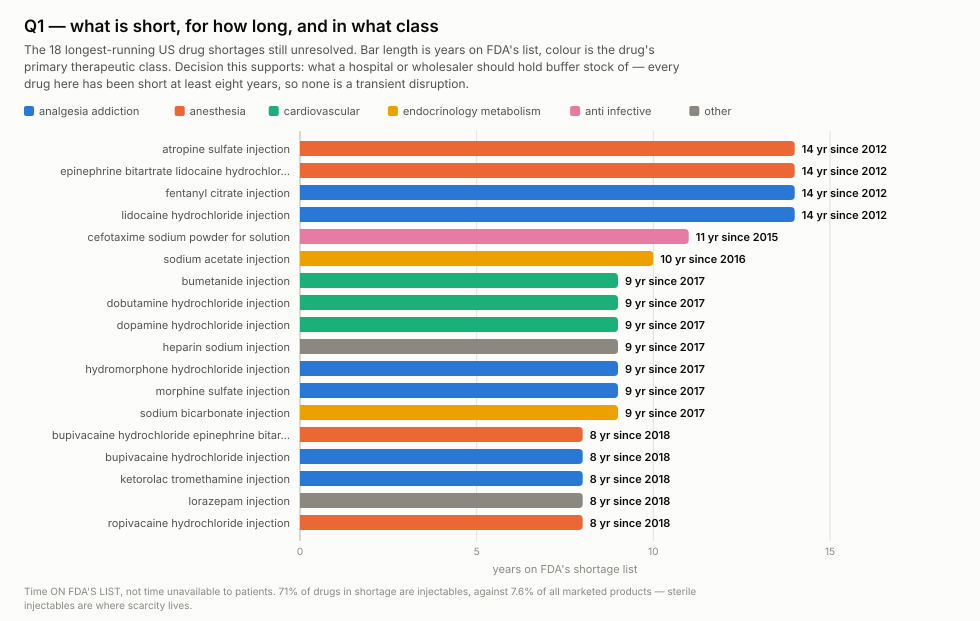
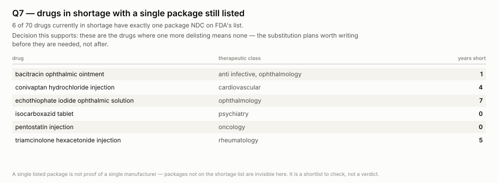
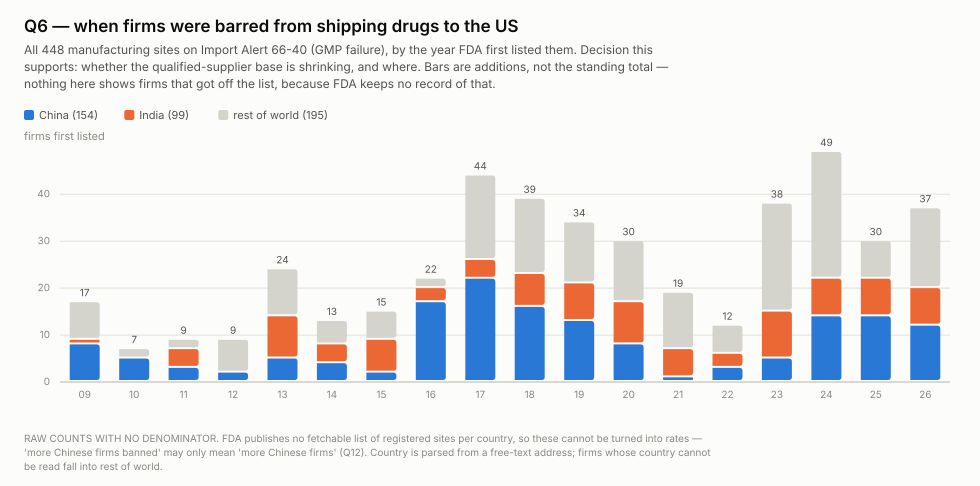
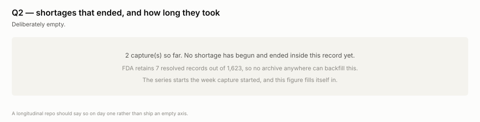

# wss-drug-scarcity

**Which medicines America cannot get, and for how long** — captured weekly,
because the FDA deletes the answer.

FDA publishes the drugs in shortage *today*. When a shortage ends, the record
leaves the feed. On 2026-08-31 the openFDA shortage endpoint held **1,173
Current, 443 To Be Discontinued and 7 Resolved** — seven, across fourteen
years of shortage management. "How long does a US drug shortage last?" is a
question nobody can answer, including the FDA. This repo starts answering it.

> **Before using any duration figure:** a shortage is recorded per *package
> NDC*, not per drug, and `initial_posting_date` is when FDA first posted that
> package — not when supply actually failed. A drug can be listed, quietly
> reverified 40 times, and never resolve. Read every duration as **time on
> FDA's list**, never as time unavailable to patients.

> **And before comparing any two countries:** counts here have no denominator.
> FDA does not publish a fetchable list of registered establishments per
> country, so "China 156 firms banned" cannot be turned into a rate. Every
> count in this repo is a share of a stated base or it is nothing (Q12).

## Questions this exists to answer

A source that answers no question gets dropped. A question nothing answers is
the next thing to build. Append freely.

| # | Question | Status |
| --- | --- | --- |
| Q1 | Mean shortage duration — per substance, per drug, per category | needs ~12 months — **the founding question** |
| Q2 | Which shortages resolve, and which never do? | needs ~12 months |
| Q3 | Does availability track price? | answerable for 48.5% of the list — but see the ASP caveat |
| Q4 | Which suppliers are fragile? | reframed — count suppliers per substance, never track company identity |
| Q5 | Does an import ban predict a shortage? (−12…+12 months) | needs ~12 months — both axes verified, only shortage state is missing |
| Q6 | How long do firms stay banned, and who gets off? | needs ~26 weeks — additions dated, **removals destroyed** |
| Q7 | How concentrated is supply per drug? | answerable — join to the NDC/NSDE reference tables |
| Q8 | Which dosage forms are fragile, against a benchmark? | **answered: injectables are 7.6% of marketed products but 71% of shortages — 9.3× enrichment** |
| Q9 | Is the shortage list maintained, or stale? | **answered: 1,010 of 1,623 records touched within 8–30 days** |
| Q10 | Do recalls precede shortages? | needs ~12 months — same design as Q5, source not yet added |
| Q11 | Is scarcity a US artefact or a global one? | blocked — EMA shortage page 404s, needs casing |
| Q12 | What share of a country's registered sites are banned? | blocked — DECRS is JavaScript-gated, no public denominator |
| Q13 | **Why doesn't someone else just make it?** | **answered: 51% of every product ever approved for these drugs is discontinued** |
| Q14 | Do suppliers leave *before* a shortage or after it? | needs a new source — Drugs@FDA keeps the count, not the date (entry written, paused on cost) |

## What the first capture already shows

**Q8 — 70 distinct generics are in shortage; 61 have been for over two
years.** Fentanyl citrate and atropine sulfate injection have been listed
continuously since 2012-01-01.

```
  10+ yr   ######                             6
  5-10 yr  #######################           23
  2-5 yr   ################################  32
  1-2 yr   #####                              5
  <1 yr    ####                               4
```

**Q6 — two import-alert lists, two different populations.** 66-40 is the one
that touches supply.

| alert | what | blocks on the page | distinct firms |
| --- | --- | --- | --- |
| **66-40** | manufacturing sites that failed GMP inspection | 466 | **448** |
| 66-41 | firms shipping unapproved / adulterated drugs | 1,921 | 1,793 |

A firm can occupy several blocks (multiple addresses, or product groups split
across the page), so the derived count is lower than the raw block count. For
66-40 the membership breaks down China 154, India 99, Canada 23, Mexico 17 —
and **33 firms whose country the parser cannot read**, 7.4% of the list. The
address line is free text with no country field, so that residual is a known
limitation, reported rather than hidden.

Additions carry a publish date. **Removals carry nothing** — a firm that gets
off the list disappears, and no record that it was ever there survives. That
asymmetry is the whole case for capturing it.

**Q13 — nobody fills the gap because they already left.** Matching the 70
drugs in shortage to Drugs@FDA, 57 resolve to approved applications:

```
  products ever approved, still marketed   1,874
  products ever approved, discontinued     1,946     51% attrition

  cefotaxime sodium              40 approved,  0 still marketed   short since 2015
  fentanyl citrate injection     71 gone,      6 left   (92%)     short since 2012
  dopamine hydrochloride inj     39 gone,     13 left   (75%)     short since 2017
  heparin sodium injection      167 gone,     77 left   (68%)     short since 2017
```

These are not drugs nobody knows how to make. Dozens of firms were approved to
make each one and exited — and for cefotaxime, every single one did. A shortage
of a 40-year-old sterile generic is an exit event, not a technical failure.

What Drugs@FDA cannot say is *when* they left, which is Q14.

**Q5 — the cross-sectional join does not work, and that is the finding.** Of
448 GMP-banned firms, exactly three are current shortage suppliers (Baxter
Healthcare, Sun Pharmaceutical, Huons). Three of 466 says nothing about
causation. Whether a ban is *followed* by a shortage is only visible if both
lists are sampled over time.

## The price and volume axes already exist

Neither is captured here. Both are CMS-archived, and both join on NDC.

| axis | source | back to | coverage of the shortage list |
| --- | --- | --- | --- |
| price, retail | NADAC, weekly per NDC | 2014 | 38.4% of non-injectables |
| price, hospital | CMS ASP quarterly + NDC-HCPCS crosswalk | 2020 | **53.6% of injectables** |
| volume | Medicaid SDUD, per NDC per state per quarter | 1991 | joins on NDC |

Together they price **48.5%** of shortage NDCs. The two are near-disjoint by
design — ASP reaches 0.6% of non-injectables, NADAC 4.7% of injectables — so
both are needed.

> **The ASP caveat, which changes the study design.** ASP is a formula, not a
> market price: it is derived from manufacturer-reported sales two quarters
> back. Across 2021–2025 drugs in continuous shortage barely move — dopamine
> −1%, dobutamine +11% over four and a half years, below inflation. Scarcity
> does not reach ASP the way it would a spot price. **Volume is the better
> dependent variable than price, and supplier count better still.**

And the reason the event study cannot be run today is worth stating plainly:
every drug old enough to have a price history has been in shortage for the
*entire* window. There is no "before". Manufacturing that "before" is the job.

## Sources

| source_id | what | cadence | destroys own history? |
| --- | --- | --- | --- |
| `fda.shortages.current` | openFDA shortage feed, 1,623 records over 2 pages | weekly | **yes** — resolved records leave the feed |
| `fda.importalert.66-40` | GMP-failure DWPE list, 1.9 MB HTML, 448 firms | weekly | **yes** — delistings vanish |
| `fda.importalert.66-41` | unapproved-drugs DWPE list, 6.5 MB HTML, 1,793 firms | monthly | **yes** — delistings vanish |
| `fda.nsde.marketing` | 666,787 products, marketing start/end | — | no — **paused on purpose** |
| `fda.drugsfda.applications` | 29,298 applications, current marketing_status | — | yes — **paused pending a cost decision (Q14)** |

`fda.nsde.marketing` is committed as `paused` because FDA retains products
after they stop being marketed, so capture would add nothing. The entry exists
so the decision is not re-litigated, and because it is the reference table Q7
joins against. **DailyMed labels were rejected outright** for the same reason:
they serve full per-label version history (metformin v1 2013 → v10 2026).

## What you can build

All figures come from [examples/visualize.py](examples/visualize.py) — stdlib
only, deterministic, regenerated from the derived table.

**The test each one has to pass: after reading it, can someone act without
running another query?** A count of drugs fails that test — it gives a number
and sends the reader back for the names. So every figure names the drugs,
carries their therapeutic class, and states the decision it supports.



**Q1.** The 18 longest-running shortages, named, coloured by class. Anaesthesia
and analgesia dominate the eight-year-plus tail, and every drug on it is an
injectable. Supports: what to hold buffer stock of.



**Q7.** Six named drugs are down to a single listed package. Supports: which
substitution plans to write before they are needed. A shortlist to check, not
a verdict — packages not on the shortage list are invisible here.



**Q6.** Bans by year of first listing, split China / India / rest of world.
Additions have run at 30-49 a year since 2023 against 7-24 before 2016, and
China plus India are now most of each year's additions. Supports: whether the
qualified-supplier base is narrowing, and where. Raw counts, no denominator —
read Q12 first.



**Q2, deliberately empty.** No shortage has begun and ended inside this record
yet, and no archive anywhere can backfill it. The figure fills itself in.

Palette is the dataviz reference instance, categorical slots in fixed order,
validated rather than eyeballed — all checks pass with a contrast warning on
three slots, which is why every mark carries a visible text label.

## Using it

**Reading this data needs nothing** — no key, no account, no clone:

```bash
B=https://raw.githubusercontent.com/neldivad/wss-drug-scarcity/main/derived/observations
duckdb -c "SELECT * FROM read_csv_auto('$B/2026-09.csv') LIMIT 5"
```

Columns are `series_id, entity_id, observed_at, captured_at, metric, value,
unit, source_id, raw_ref, parser_version`. Entity ids are **composite**, so
every aggregate is a prefix GROUP BY and never a parse-time count:

```
drug:atropine-sulfate-injection/ndc:00517100425
country:china/firm:zhejiang-...
```

**Current state is per entity, not per timestamp.** The shortage feed is
paged and each endpoint carries its own fetch time, so filtering on
`observed_at = max(observed_at)` keeps only the last page — it drops a third
of the drugs and nothing warns you. Take the newest row per entity;
`examples/queries.sql` defines a `latest_state` view that does exactly that.

Metrics: `listed` (1 = on the list this week), `status_code` (0 Resolved,
1 Current, 2 To Be Discontinued), `availability` (0 Unavailable, 1 Limited,
2 Available), `first_listed` / `last_update` (YYYYMMDD integers, never ages —
so a re-derive years from now is byte-identical), `product_entries`,
`firms_listed`, `feed_records_total`, `is_injectable`.

Every query in [examples/queries.sql](examples/queries.sql) shows the pattern.

## Storage

Roughly **31 MB/year** in git, measured on real captures. The payloads are
repetitive JSON and HTML that zlib to 4-14% of raw size, so the 12 MB `raw/`
directory is under 1 MB of actual git objects. At that rate GitHub's 1 GB soft
warning is three decades out, and object storage is not a decision this repo
needs to make. If it ever is, `storage: object` on one registry entry moves
that source to R2 and nothing else changes.

## Contributing

**The test for a new source: which open question does it close?** If none, it
does not go in. That rule is why openFDA's enforcement (recall) endpoint is
*not* here yet — it answers Q10, but at ~3.2 MB per capture of a payload where
any single status change rewrites the whole blob, and Q10 needs twelve months
of shortage history before the join is even meaningful. It goes in when the
question is ready, not when the endpoint is convenient.

Adding one is a single file in `registry/`, plus a parser if the payload shape
is new. No workflow edits, ever — except one line in `derive.yml`'s `PARSERS`
when a genuinely new *schema* appears.

## Manners

FDA endpoints are public and unauthenticated. The import alerts are single
documents of 1.9 MB and 6.5 MB — fetched **once each, whole, never per-firm**,
15 seconds apart. openFDA paginates at 1,000; the shortage feed is two
requests. All of it runs in one shard, because sharding parallelises across
sources and more shards would mean more runners hitting one host at once.

`personal_data: none` is load-bearing here. FAERS adverse-event reports and
MAUDE narratives carry patient age, sex and free text. **Counts only, never
case-level** — and the registry rejects anything else.

## Licences

Code MIT; data CC-BY-4.0. Sources are US federal works
([openFDA terms](https://open.fda.gov/terms/)), which carry no US copyright
but do carry a no-endorsement condition: do not imply FDA review or
endorsement of anything derived here.

**This is not medical or procurement advice.** A drug's absence from this
dataset is not evidence it is available, and its presence is not evidence a
patient cannot get it.
